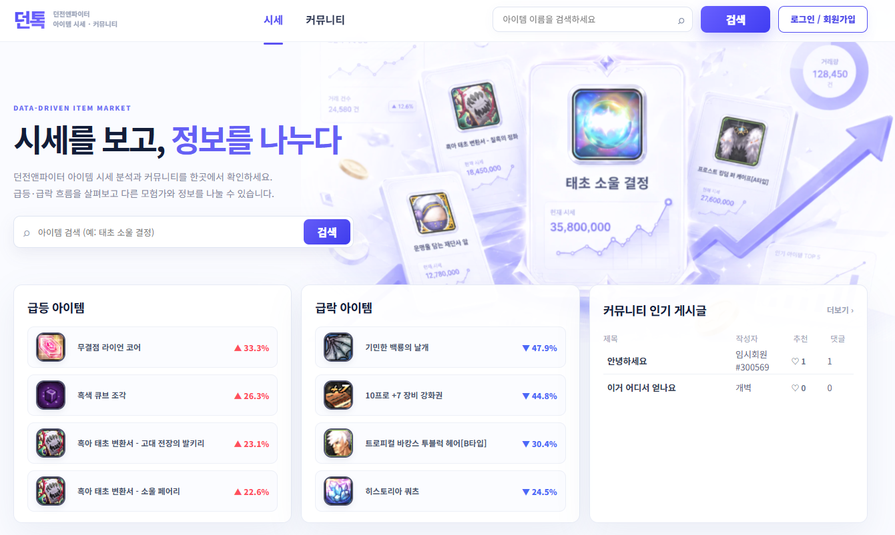
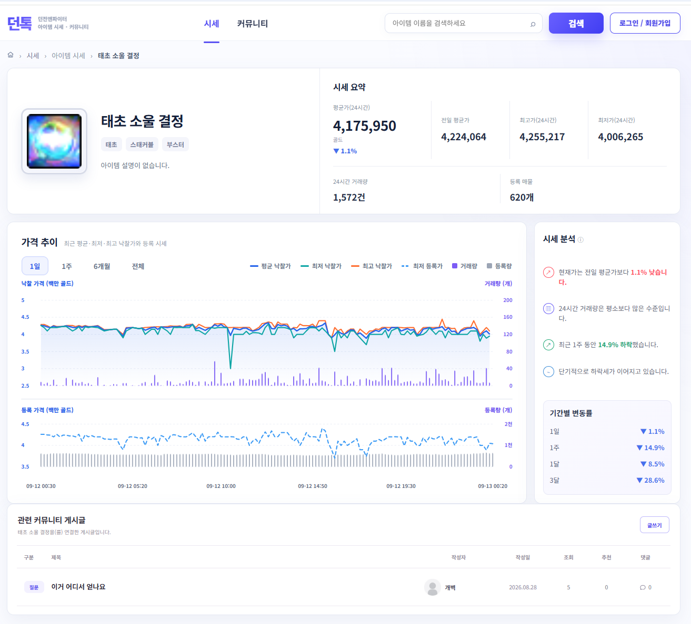
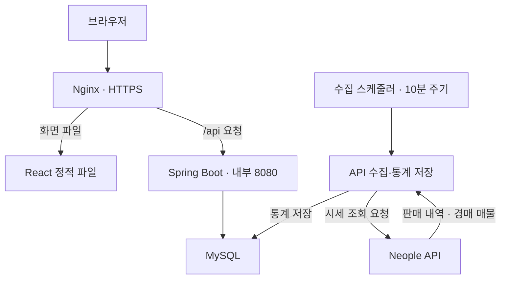

# DunTalk Backend

던전앤파이터 아이템의 시세를 수집·집계하고, 관련 정보를 나눌 수 있는 커뮤니티 서비스입니다.

Neople API에서 판매 내역과 경매 매물을 10분 주기로 수집합니다. 판매·경매 통계를 시간·일·주 단위로 집계해 기간별 가격과 거래·등록 수량을 조회할 수 있습니다.

- **서비스:** [duntalk.kr](https://duntalk.kr/)
- **개발:** 김동영 · 개인 프로젝트 · 2026.06 - 현재
- **담당:** 백엔드 설계·구현, 배포·운영 (프런트엔드는 AI 도구를 활용해 구현)

| 시세 수집 병렬화 | 시세 조회 지연 개선 | 커뮤니티 N+1 제거 |
| --- | --- | --- |
| **75~90초 → 21.8초** | **3.32초 → 50.7ms** | **22회 → 2회** |
| 순차 운영 기록 → 20스레드 실험 평균 | 최근 1일 시세 API 평균 응답 시간 | 게시글·댓글 목록 각각 SQL 실행 횟수 |

## 목차

- [서비스 화면](#서비스-화면)
- [주요 기능](#주요-기능)
- [기술 스택](#기술-스택)
- [서비스 구조](#서비스-구조)
- [핵심 설계와 개선](#핵심-설계와-개선)
- [수집·집계·보관 정책](#수집집계보관-정책)
- [운영 로그와 실패 처리](#운영-로그와-실패-처리)
- [로컬 실행](#로컬-실행)
- [주요 API](#주요-api)
- [테스트 범위](#테스트-범위)
- [코드 구조](#코드-구조)

## 서비스 화면

### 메인 화면

아이템 검색, 가격 변동 랭킹과 커뮤니티 인기 게시글을 한 화면에서 확인할 수 있습니다.



### 아이템 시세 상세

Neople API에서 수집한 판매·경매 데이터를 집계해 시세 요약, 기간별 가격 추이, 거래량과 등록량을 제공합니다.



[서비스 직접 보기](https://duntalk.kr/) · [수집 구조와 성능 개선 과정](#핵심-설계와-개선)

## 주요 기능

| 영역 | 기능 |
| --- | --- |
| 아이템 | 검색·자동완성, 아이템 등록·상세 조회, 가격 변동 랭킹 |
| 시세 | 판매 내역·경매 매물 수집, 기간별 통계 조회, 시간 단위별 집계·보관 |
| 커뮤니티 | 게시글 검색·정렬·페이징, 작성·수정·삭제, 댓글·대댓글, 좋아요, 아이템별 관련 게시글 |
| 회원 | Google OAuth2 로그인, 서비스 회원가입, 게임 캐릭터 소유 검증 |

## 기술 스택

| 구분 | 기술 |
| --- | --- |
| Backend | Java 17, Spring Boot 4.0.6, Spring MVC, Spring Data JPA, Spring Security |
| 외부 API 연동 | WebClient, CompletableFuture, ThreadPoolTaskExecutor, Resilience4j RateLimiter |
| Database | MySQL |
| Test | JUnit 5, Mockito |
| 배포·도구 | AWS EC2, Nginx, HTTPS, Gradle, Git/GitHub |
| Frontend | React, Vite — 별도 프로젝트 |

## 서비스 구조



Nginx가 React 정적 파일을 제공하고, `/api` 요청을 Spring Boot로 전달합니다.

## 핵심 설계와 개선

### 1. 외부 API 병렬화와 운영 스레드 수 선정

아이템별 순차 호출에서 누적되는 외부 API 응답 대기를 줄이기 위해 `CompletableFuture`와 고정 크기 스레드 풀을 적용했습니다. 각 단계의 API 결과를 모은 뒤 DB에 순차 저장합니다.

**수집 순서:** 판매 API 병렬 호출 → 판매 내역 순차 저장 → 경매 API 병렬 호출 → 경매 통계 순차 저장 → 판매 10분 통계 집계

Neople Open API의 호출 한도는 API Key 기준 초당 500회입니다. 캐릭터 인증 등 다른 API 호출의 여유를 두기 위해 가격 수집 요청을 초당 400회 수준으로 제한했습니다. 판매·경매 수집은 `4회/10ms`로 설정한 동일한 RateLimiter를 사용합니다.

1,690개 아이템을 대상으로 호출 상한과 DB 순차 저장 방식을 유지하고, 스레드 수를 바꿔 총 32회 측정했습니다.

| 스레드 수 | 측정 횟수 | 전체 수집 시간 평균 | 중앙값 |
| ---: | ---: | ---: | ---: |
| 8 | 6회 | 43.09초 | 43.15초 |
| 12 | 8회 | 37.79초 | 37.22초 |
| 16 | 6회 | 29.98초 | 32.64초 |
| **20** | **6회** | **21.80초** | **21.66초** |
| 24 | 6회 | 22.35초 | 21.24초 |

20개에서 판매·경매 API 구간 합계는 약 **9.08초**였습니다. 최대 3,380회 호출을 초당 400회 수준으로 제한했을 때 호출 허가만 고려한 시간인 약 **8.45초**에 근접했고, 추가 스레드의 효과가 제한적이어서 20개를 운영값으로 선정했습니다. 해당 실험에서 8개 대비 전체 수집 시간을 약 **49.4%** 줄였습니다.

전체 수집 시간에는 API 호출 외에 DB 저장·아이템 조회·판매 통계 집계 등이 포함됩니다. 표의 평균은 첫 실행을 포함한 전체 기록을 사용했습니다. 24개 조건의 첫 회차는 애플리케이션 재기동 직후 실행이며, 해당 회차를 제외한 평균은 **21.01초**입니다.

최초 병렬화 실험에서는 외부 API 응답 지연 시점의 인접 시간대에서 비교해, 순차 4회 평균 **196.5초 → 8스레드 3회 평균 54.9초**를 기록했습니다.

### 2. 시세 조회 지연 개선

약 463만 건이 누적된 경매 10분 통계의 최근 1일 조회 지연을 `EXPLAIN ANALYZE`로 분석했습니다. `item_id` 단일 인덱스로 해당 아이템의 과거 데이터를 읽은 뒤 시간 조건으로 거르는 구조를 확인했습니다.

사용자 조회 범위를 벗어나고 이미 상위 시간 단위로 집계된 과거 세부 데이터는 삭제해도 된다고 판단했습니다. 기존 집계 구조를 활용해 해상도별 보관 정책을 적용하고 데이터를 정리했습니다.

| 측정 대상 | 개선 전 | 개선 후 |
| --- | ---: | ---: |
| 최근 1일 시세 API 평균 응답 시간 | 3.32초 | 50.7ms |
| 경매 10분 통계 인덱스로 읽은 행 | 4,828건 | 183건 |

API 응답 시간은 동일 EC2의 localhost에서 동일 아이템·API를 전후 각 10회 호출한 `curl total` 기준이며, 첫 호출을 포함합니다. 해당 API는 판매·경매 10분 통계를 함께 반환합니다.

### 3. 커뮤니티 N+1 제거

| 조회 시나리오 | 기존 문제 | 변경 |
| --- | --- | --- |
| 게시글 목록의 댓글 수 | 게시글마다 댓글 수 COUNT 실행 | `CommunityPost.commentCount`에 집계값 저장 |
| 댓글 목록의 사용자 좋아요 여부 | 댓글마다 로그인 사용자의 좋아요 조회 | `LEFT JOIN`과 `CASE`를 활용한 DTO 조회 |

댓글 작성·삭제보다 게시글 목록 조회가 잦을 것으로 예상해, 조회할 때마다 댓글 수를 집계하는 대신 게시글에 댓글 수를 별도 저장했습니다. 댓글 생성·삭제 시 추가 갱신 비용과 집계값 관리를 감수하는 대신, 댓글 변경과 댓글 수 갱신을 동일 트랜잭션에서 처리하고 원자적 증감 쿼리를 사용했습니다.

게시글 목록 20개와 로그인 사용자의 댓글 목록 20개 조회에서 SQL 실행 횟수를 **각각 22회 → 2회**로 줄였습니다. 동일 테스트 DB·데이터에서 개선 전후 API의 Hibernate SQL 로그를 비교했습니다.

### 4. 로그인과 캐릭터 소유 검증

Google OAuth2 로그인 후 소셜 계정의 `provider + providerId`로 서비스 회원을 조회합니다. 기존 회원은 세션 기반으로 로그인하고, 미가입 계정은 소셜 계정 정보를 세션에 임시 보관한 뒤 서비스 회원가입을 진행합니다.

서비스 표시 이름을 게임 내 계정 표시명(모험단명)과 일치시키기 위해 캐릭터 소유를 검증합니다. 직접 검증 API가 제공되지 않아 공개 API로 확인할 수 있는 장비 상태 변화를 활용했습니다.

1. 캐릭터의 착용 장비 하나를 무작위로 선택하고, 검증할 슬롯과 5분의 만료 시간을 세션에 저장합니다.
2. 사용자가 게임에서 지정된 장비를 해제합니다.
3. API를 재조회해 지정한 슬롯의 장비가 해제됐는지 확인합니다.
4. 검증 성공 시 캐릭터와 회원을 연결하고 `ROLE_ADVENTURER`를 부여하며 로그인 권한 정보를 갱신합니다.

인증 후에는 모험단명을 표시 이름으로 사용하고, 미인증 회원은 `임시회원#XXXXXX`로 표시합니다.

## 수집·집계·보관 정책

판매는 최근 저장 거래와 비교해 새로 확인된 거래 내역을 저장합니다. 경매는 수집 시점의 최저 등록가와 조회된 매물의 등록 수량 합계를 10분 통계로 저장합니다.

| 작업 | 실행 주기 |
| --- | --- |
| 판매·경매 수집 및 판매 10분 통계 집계 | 10분마다 |
| 1시간 통계 집계 | 매시 4분 |
| 일간 통계 집계 | 매일 00:05 |
| 주간 통계 집계 | 매주 월요일 04:00 |
| 가격 변동 랭킹 갱신 | 매시 6분 |
| 과거 데이터 정리 | 매일 05:44 |

스케줄은 애플리케이션 실행 환경의 시간대를 따릅니다.

| 통계 단위 | 사용자 조회 기간 | 추가 보관 여유 | 정리 기준 |
| --- | ---: | ---: | ---: |
| 10분 | 24시간 | 12시간 | 36시간 이전 |
| 1시간 | 7일 | 1일 | 8일 이전 |
| 일간 | 6개월 | 7일 | 6개월 + 7일 이전 |

판매 원본은 2일 이전 데이터를 정리하고, 주간 통계는 기간 제한 없이 보관합니다.

## 운영 로그와 실패 처리

수집 작업의 전체 시간과 아이템 조회·판매·경매·통계 집계 구간을 기록합니다. 판매·경매는 API 호출과 DB 저장 시간을 나누어 기록하고, 데이터 정리 시 테이블별 삭제 건수를 남깁니다.

| 실패 범위 | 처리 |
| --- | --- |
| 개별 아이템의 일반 HTTP 오류 | 해당 아이템을 제외하고 나머지 수집 계속 |
| 점검·API 사용량 제한 오류 코드 | 중단 신호 공유 후 해당 수집 회차 중단 |
| 연결·응답 수신 실패 | 중단 신호 공유 후 해당 수집 회차 중단 |

## 로컬 실행

### 준비

- JDK 17
- MySQL과 접속 가능한 데이터베이스
- Neople API 키
- 소셜 로그인 클라이언트 설정

```bash
git clone https://github.com/kdyddd/duntalk.git
cd duntalk
```

### 환경변수

`src/main/resources/application.yml`에서 사용하는 환경변수를 IDE 실행 설정 또는 실행 셸에 지정합니다.

| 변수 | 설명 |
| --- | --- |
| `DB_URL` | MySQL JDBC URL. 예: `jdbc:mysql://localhost:3306/duntalk` |
| `DB_USERNAME` | 데이터베이스 사용자 |
| `DB_PASSWORD` | 데이터베이스 비밀번호 |
| `NEOPLE_API_KEY` | Neople API 키 |
| `GOOGLE_CLIENT_ID` | Google OAuth2 클라이언트 ID |
| `GOOGLE_CLIENT_SECRET` | Google OAuth2 클라이언트 Secret |
| `NAVER_CLIENT_ID` | Naver OAuth2 클라이언트 ID |
| `NAVER_CLIENT_SECRET` | Naver OAuth2 클라이언트 Secret |
| `SERVER_ADDRESS` | 바인딩 주소. 기본값 `127.0.0.1` |
| `SERVER_PORT` | 백엔드 포트. 기본값 `8080` |
| `FRONTEND_URL` | 프런트엔드 주소. 기본값 `http://localhost:5173`. 로그인 이동 경로는 코드에서 별도 지정 |

운영 서비스에서는 Google 로그인을 제공합니다. 소스에는 Naver 등록 설정도 포함되어 있으므로, 현재 설정 그대로 실행할 때는 해당 환경변수도 지정합니다. OAuth2 콜백 주소는 사용하는 제공자에 `/login/oauth2/code/google` 또는 `/login/oauth2/code/naver` 경로를 포함한 실제 접근 URL로 등록합니다.

프런트엔드는 별도로 실행해야 합니다. 로그인 성공 후에는 `/` 또는 `/signup`으로 이동하므로, 화면과 인증·API 경로를 함께 제공하는 프록시 구성이 필요합니다.

### 실행·테스트

```bash
# macOS / Linux
./gradlew bootRun

# 서비스 단위 테스트
./gradlew test

# 실행 JAR 생성
./gradlew bootJar
```

Windows에서는 `./gradlew` 대신 `.\gradlew.bat`를 사용합니다. 예를 들어 `.\gradlew.bat bootRun`으로 실행합니다. macOS/Linux에서 실행 권한 오류가 발생하면 `chmod +x gradlew`로 권한을 부여합니다.

현재 JPA 설정은 `ddl-auto: update`입니다. 데이터베이스를 먼저 준비하면 실행 시 엔티티에 따라 테이블을 생성·갱신합니다. 빈 DB에서는 아이템 등록과 수집이 진행된 이후부터 시세 데이터가 쌓입니다.

## 주요 API

아래 경로는 백엔드 직접 호출 기준입니다. 운영 서비스에서는 `/api` 접두사를 붙입니다.

| Method | 경로 | 기능 |
| --- | --- | --- |
| GET | `/items?itemName=...` | 아이템 검색 |
| POST | `/items?itemName=...` | 아이템 등록 |
| GET | `/items/autocomplete?itemName=...` | 자동완성 |
| GET | `/items/{itemId}` | 아이템 상세 |
| GET | `/items/{itemId}/statistics?interval=TEN_MINUTES` | 시세 통계 |
| GET | `/items/rankings` | 가격 변동 랭킹 |
| GET / POST | `/community/posts` | 게시글 목록 / 작성 |
| GET / PUT / DELETE | `/community/posts/{communityPostId}` | 게시글 상세 / 수정 / 삭제 |
| GET | `/community/posts/item/{itemId}` | 아이템 관련 게시글 |
| GET / POST | `/community/posts/{communityPostId}/comments` | 댓글 목록 / 작성 |
| DELETE | `/community/comments/{communityCommentId}` | 댓글 삭제 |
| POST | `/community/posts/{communityPostId}/like` | 게시글 좋아요 전환 |
| POST | `/community/comments/{communityCommentId}/like` | 댓글 좋아요 전환 |
| GET | `/auth/me` | 현재 로그인 상태 |
| POST | `/members/signup` | 서비스 회원가입 |
| GET | `/members/character` | 게임 캐릭터 검색 |
| POST | `/members/character/equipment` | 캐릭터 검증 시작 |
| POST | `/members/character/equipment/confirm` | 장비 해제 확인 및 인증 |
| GET | `/csrf` | CSRF 토큰과 헤더 이름 조회 |

통계 `interval`은 `TEN_MINUTES`, `HOUR`, `DAY`, `WEEK`를 지원합니다. 커뮤니티 쓰기·좋아요 및 캐릭터 인증은 로그인이 필요하며, 변경 요청에는 세션과 CSRF 토큰을 함께 전달합니다. 게시글 수정·삭제와 댓글 삭제 권한은 서비스 계층에서도 확인합니다.

## 테스트 범위

JUnit 5와 Mockito로 서비스 계층의 주요 규칙을 검증합니다.

- 이미 가입된 소셜 계정의 중복 가입 거부
- 장비 해제 시 캐릭터 인증 완료, 중복 등록 캐릭터 거부
- 존재하지 않는 게시글 조회 시 예외 처리
- 타인의 게시글 수정·댓글 삭제 거부
- 대댓글에 대한 추가 답글 제한
- 게시글 좋아요 추가 및 재요청 시 취소

## 코드 구조

| 경로 | 역할 |
| --- | --- |
| `src/main/java/com/duntalk/domain/item` | 아이템·시세 API, 외부 API 연동, 수집 스케줄러, 통계 집계 |
| `src/main/java/com/duntalk/domain/community` | 게시글·댓글·좋아요 |
| `src/main/java/com/duntalk/domain/member` | 회원가입, 소셜 계정, 캐릭터 인증 |
| `src/main/java/com/duntalk/global` | 공통 설정, 보안, 예외 처리 |
| `src/test/java/com/duntalk/domain` | 서비스 단위 테스트 |
